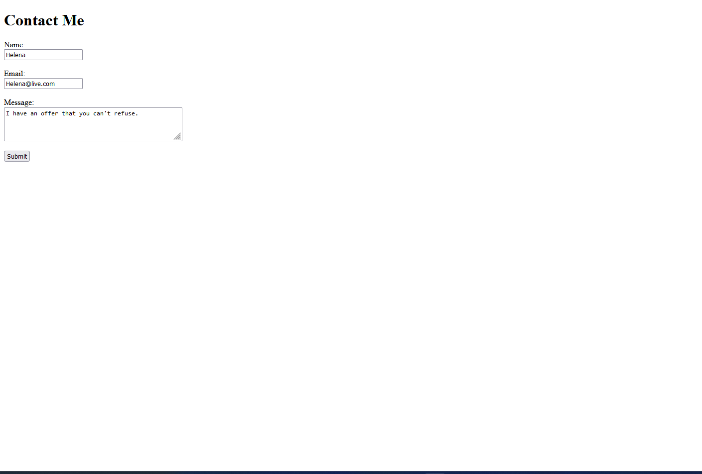

# More HTML

## Assignment: Create a webpage for contacting you

For this assignment, you will create a web page with a "Contact Me" form that allows users to send a message to a specified email address.

### Instructions
#### Add the following changes to the webpage: 
- Display a header that says 'Contact Me' 
- Display a form with a form tag
  - Accept the users name
  - Accept the users message
  - Add a submit button
- When user clicks submit, the form should open the users default email app.

Take a look at the Example.png for an idea of how the end result should look.